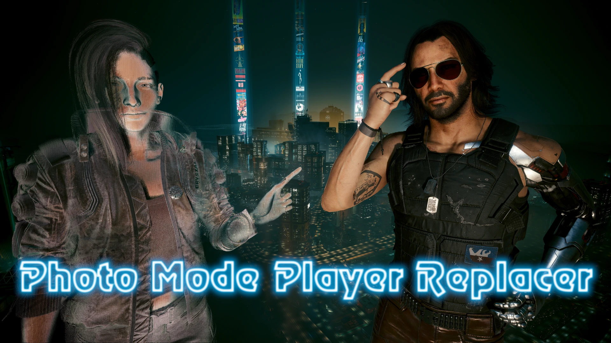

<h1>Overview</h1>

This is an unreleased mod for Cyberpunk 2077 which allows the user to swap out the player character in Photo Mode (either V or Johnny) with almost any NPC in the game.

Since it has not been published to Nexus, this repo is intentionally missing key files necessary for the mod to function properly in-game.

This mod is unfortunately not likely to be released, as one of its dependencies is no longer supported for 2.2+, and current game features/other available mods offer similar capabilities.

It may one day be integrated as a feature into my Photo Mode Options mod, but at present I am not working on video game modding.

</img>
